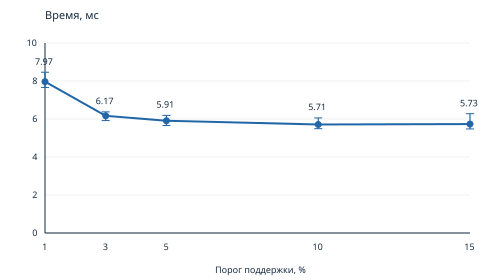

# Поиск частых наборов: Apriori

Полный воспроизводимый проект: [apriori_project.zip](apriori_project.zip).
Отчёт: [apriori_report.pdf](apriori_report.pdf).

Архив содержит все исходные тексты с короткими комментариями на русском, исходный CSV, тесты, 75 измерений, полные списки наборов в обоих порядках, SVG/PDF-диаграммы и генератор отчёта. Распакуйте архив с сохранением каталогов.

## Быстрый запуск программы

```bash
python3 apriori.py baskets.csv --support 3% --order support
python3 apriori.py baskets.csv --support 0.03 --order lex
```

## Повторение экспериментов

```bash
unzip apriori_project.zip
cd apriori_project
python3 -m unittest discover -s tests -v
python3 experiments.py
```

Для генерации PDF установите requirements.txt и шрифты Times New Roman; подробности в README внутри архива.

## Результаты

| Порог | Одиночные | Пары | Тройки | Всего |
|---|---:|---:|---:|---:|
| 1% | 74 | 170 | 17 | 261 |
| 3% | 36 | 19 | 0 | 55 |
| 5% | 25 | 3 | 0 | 28 |
| 10% | 7 | 0 | 0 | 7 |
| 15% | 5 | 0 | 0 | 5 |




Исходный baskets.csv: Windows-1251, без заголовка, 7501 корзина, 115 товаров. Программа использует только стандартную библиотеку Python 3.10+.
